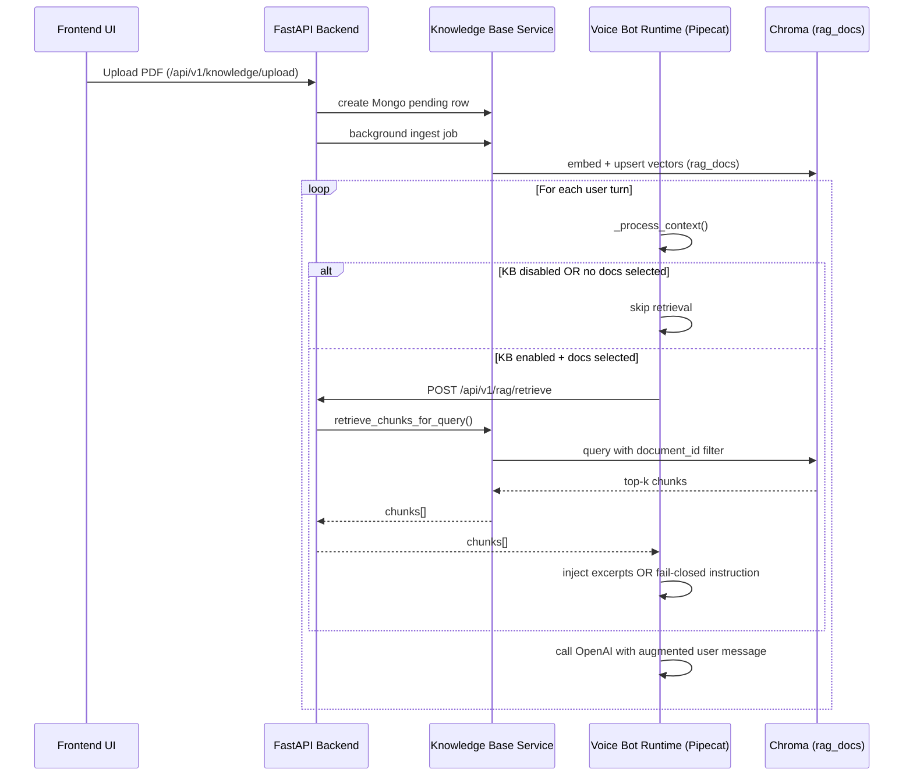

# Knowledge Base (KB) + RAG runtime integration (Voicera)

This document explains how the Knowledge Base feature is integrated end-to-end:

1. Frontend UI (agent create/edit + Knowledge Base dashboard) stores KB settings in `agent_config`.
2. Knowledge Base PDF uploads get embedded and indexed into **org-scoped Chroma**.
3. At runtime (voice bot), the OpenAI LLM service decides whether to call RAG for each user turn.
4. Retrieved excerpts are injected into the OpenAI prompt in a fail-closed way when excerpts are missing for the selected documents.

## Glossary

- KB (Knowledge Base): org-scoped PDFs that were processed into embeddings and indexed in Chroma.
- Chroma: vector database used for similarity search over chunks (collection: `rag_docs`).
- Document selection: list of `knowledge_document_ids` chosen in the agent UI.
- Retrieval: runtime search over Chroma for the user question, constrained to the selected document ids.
- Fail-closed: when KB is enabled and documents are explicitly selected, but retrieval returns zero excerpts, the bot must not answer from general knowledge.

## Big picture: where each piece lives

### Frontend

- Agent create/edit KB UI (enable switch + document tickboxes):
  - `voicera_frontend/app/(dashboard)/assistants/page.tsx`
  - `voicera_frontend/app/(dashboard)/assistants/[id]/page.tsx`
- Knowledge Base dashboard (upload/delete PDFs):
  - `voicera_frontend/app/(dashboard)/knowledge-base/page.tsx`

### Backend (FastAPI)

- Knowledge base API: list/upload/delete documents
  - `voicera_backend/app/routers/knowledge.py`
- RAG retrieval API: retrieve top-k chunks at runtime
  - `voicera_backend/app/routers/rag.py`
- Core KB logic (Mongo + Chroma + embedding/query)
  - `voicera_backend/app/services/knowledge_service.py`

### Voice bot runtime (Pipecat pipeline)

- Runtime bot config assembly and pipeline wiring:
  - `voice_2_voice_server/api/bot.py`
- LLM service factory:
  - `voice_2_voice_server/api/services.py`
- OpenAI KB-aware LLM wrapper (where retrieval decision + prompt injection happens):
  - `voice_2_voice_server/services/openai_kb_llm.py`
- Backend HTTP helpers (includes the `/api/v1/rag/retrieve` call):
  - `voice_2_voice_server/api/backend_utils.py`

## 1) What the frontend sends in `agent_config`

The agent's runtime behavior is controlled by three KB-related fields stored under `agent_config`:

1. `knowledge_base_enabled` (boolean)
2. `knowledge_document_ids` (string array)
3. `knowledge_top_k` (number)

### Agent create: payload shape

When creating an agent from the UI, the KB section writes these keys into `agent_config`:

```ts
agent_config: {
  knowledge_base_enabled: config.llmProvider === "openai" ? config.knowledgeEnabled : false,
  knowledge_document_ids:
    config.llmProvider === "openai" && config.knowledgeEnabled
      ? config.knowledgeDocumentIds
      : [],
  knowledge_top_k: config.knowledgeTopK,
  ...
}
```

Source: `voicera_frontend/app/(dashboard)/assistants/page.tsx`

### Agent edit: payload shape

The edit page persists the same keys into `agent_config` with the same gating rules:

- Only meaningful for OpenAI LLM provider.
- If KB is disabled, `knowledge_document_ids` is forced to `[]`.

Source: `voicera_frontend/app/(dashboard)/assistants/[id]/page.tsx`

### KB selection UI behavior

In the agent create/edit pages:

- The "Knowledge Base" enable control is a moving switch (checkbox-based UI).
- Each knowledge file has a tick-box on the left.
- Clicking a row toggles selection and updates `knowledgeDocumentIds`.

## 2) Knowledge Base PDFs: upload, ingest, and indexing

KB ingestion has two persistent parts:

1. A MongoDB row in `KnowledgeDocuments` that tracks status and stores `document_id`.
2. Chroma vectors stored on disk under an org-specific directory.

### 2.1 Frontend upload route

When a user uploads a PDF in the Knowledge Base dashboard:

- Browser -> Next.js proxy route:
  - `POST /api/knowledge-base` (multipart)
- Next.js proxy -> FastAPI:
  - `POST /api/v1/knowledge/upload`

Sources:
- `voicera_frontend/app/api/knowledge-base/route.ts`
- `voicera_backend/app/routers/knowledge.py`

### 2.2 FastAPI upload handler (Mongo row + background job)

In `voicera_backend/app/routers/knowledge.py`:

1. A new `document_id` is created and inserted into Mongo with `status="processing"`.
2. A background task is scheduled to run the ingest pipeline.

So the HTTP request returns immediately; actual embedding happens asynchronously.

### 2.3 Ingest pipeline (PDF -> chunks -> embeddings -> Chroma)

In `voicera_backend/app/services/knowledge_service.py`:

- If `RAG_INGEST_SERVICE_URL` is set:
  - The backend forwards ingestion to the standalone `rag_server` via HTTP.
- Otherwise:
  - The backend runs ingestion locally using `rag_system.ingest_pipeline`.

Both approaches store vectors in:

- Chroma collection name: `rag_docs`
- Per-org filesystem directory:
  - derived from `CHROMA_BASE_DIR` and a hash of `org_id`

## 3) Runtime: how RAG is triggered (and how it is skipped)

This is the most important part for your question:

> "If knowledge base is not selected ... and if no documents are selected ... only if a file is selected when Knowledge base is enabled then only rag call should happen."

That behavior is implemented at runtime inside the OpenAI KB-aware LLM wrapper.

### 3.1 Voice bot runtime pulls KB fields from `agent_config`

When the voice bot starts, `voice_2_voice_server/api/bot.py`:

1. Reads `agent_config` (the whole persisted config from backend).
2. Builds an `llm_config` dict for the selected LLM provider.
3. For OpenAI only, it copies:
   - `knowledge_base_enabled`
   - `knowledge_document_ids`
   - `knowledge_top_k`

Source: `voice_2_voice_server/api/bot.py`

### 3.2 Service factory instantiates the KB-aware LLM wrapper

In `voice_2_voice_server/api/services.py`, when provider is OpenAI:

- it creates `OpenAIKnowledgeLLMService(api_key, org_id, knowledge_enabled, knowledge_document_ids, knowledge_top_k)`

So KB settings become fields on the wrapper instance.

Source: `voice_2_voice_server/api/services.py`

### 3.3 Retrieval decision happens per LLM context build

Pipecat calls the LLM wrapper to process context when it is preparing the OpenAI prompt.

In `voice_2_voice_server/services/openai_kb_llm.py`:

1. If `knowledge_base_enabled` is false, it immediately delegates to `super()._process_context(context)` without any retrieval call.
2. If `org_id` is missing, it also delegates without retrieval.
3. If `knowledge_document_ids` is empty, it delegates without retrieval.

Only if all of the above are satisfied does it call the backend retrieval endpoint.

## 4) Where the actual RAG call goes

When retrieval is allowed, the LLM wrapper calls:

- `POST {VOICERA_BACKEND_URL}/api/v1/rag/retrieve`

Payload keys:

```json
{
  "org_id": "...",
  "question": "user question",
  "top_k": 3,
  "document_ids": ["<selected document_id>", "..."]
}
```

Source:
- `voice_2_voice_server/api/backend_utils.py` -> `fetch_knowledge_chunks()`
- `voicera_backend/app/routers/rag.py` -> `POST /rag/retrieve`

## 5) Retrieval behavior: constrain to selected documents + safety belt

In `voicera_backend/app/services/knowledge_service.py` (function `retrieve_chunks_for_query`):

- The query embedding is generated with OpenAI embedding model.
- Chroma is queried from the `rag_docs` collection.
- It applies a filter:
  - `where = {"document_id": {"$in": selected_ids}}`

Additionally, there is a safety belt:

- If the caller provides `document_ids=[]` (explicitly empty list), it returns `[]` immediately and does not search across all documents.

## 6) Fail-closed behavior (no excerpts found)

Your requirement says:

- If KB is enabled and docs are selected, but retrieval yields zero excerpts:
  - respond in a fail-closed manner (explicitly state it cannot answer from provided knowledge).

That is implemented in `OpenAIKnowledgeLLMService._process_context`:

1. After calling retrieval, if `chunks` is empty:
   - it modifies the latest user message content to include a special instruction like:
     "You must respond that you do not have enough information from the provided knowledge to answer."
2. It then calls the parent OpenAI context processor to get an LLM response.
3. Finally it restores the original user content to avoid polluting state.

This means:

- KB enabled + docs selected + zero matches => the model is steered into a grounded "cannot answer" response.
- KB enabled + docs selected + non-zero matches => excerpts are injected and the model answers using them.

## 7) "Is RAG called for every user query?"

Conceptually:

- The wrapper runs its context processing each time the bot prepares an LLM call (i.e., for each user turn).

Practically:

- The HTTP call to `/api/v1/rag/retrieve` happens only when:
  1. `knowledge_base_enabled` is true
  2. `org_id` exists
  3. `knowledge_document_ids` has at least one selected doc id

So:

- KB disabled => no RAG retrieval HTTP calls.
- KB enabled but nothing selected => no RAG retrieval HTTP calls.
- KB enabled and docs selected => RAG retrieval HTTP calls occur for each user turn.

## 8) End-to-end flow diagram (data movement)



## 9) Files and endpoints checklist

### Frontend writes KB settings into `agent_config`
- `voicera_frontend/app/(dashboard)/assistants/page.tsx`
- `voicera_frontend/app/(dashboard)/assistants/[id]/page.tsx`

### Knowledge Base dashboard uploads/deletes PDFs
- `voicera_frontend/app/(dashboard)/knowledge-base/page.tsx`
- `voicera_frontend/app/api/knowledge-base/route.ts`
- `voicera_frontend/app/api/knowledge-base/[documentId]/route.ts`

### Backend ingestion APIs
- `voicera_backend/app/routers/knowledge.py`
  - `GET /api/v1/knowledge`
  - `POST /api/v1/knowledge/upload`
  - `DELETE /api/v1/knowledge/{document_id}`

### Backend runtime retrieval API
- `voicera_backend/app/routers/rag.py`
  - `POST /api/v1/rag/retrieve`

### Voice bot runtime KB augmentation
- `voice_2_voice_server/api/bot.py` (reads KB config into `llm_config`)
- `voice_2_voice_server/api/services.py` (creates `OpenAIKnowledgeLLMService`)
- `voice_2_voice_server/services/openai_kb_llm.py` (retrieval guards + injection/fail-closed)
- `voice_2_voice_server/api/backend_utils.py` (HTTP call to `/api/v1/rag/retrieve`)

## Notes / assumptions

- RAG augmentation is currently implemented for OpenAI agents via `OpenAIKnowledgeLLMService`.
- Other LLM providers (Kenpath, Anthropic, etc.) do not receive KB excerpts from this wrapper.
- The Chroma query is performed with document selection filters, so the agent only retrieves from the explicitly selected KB documents.

