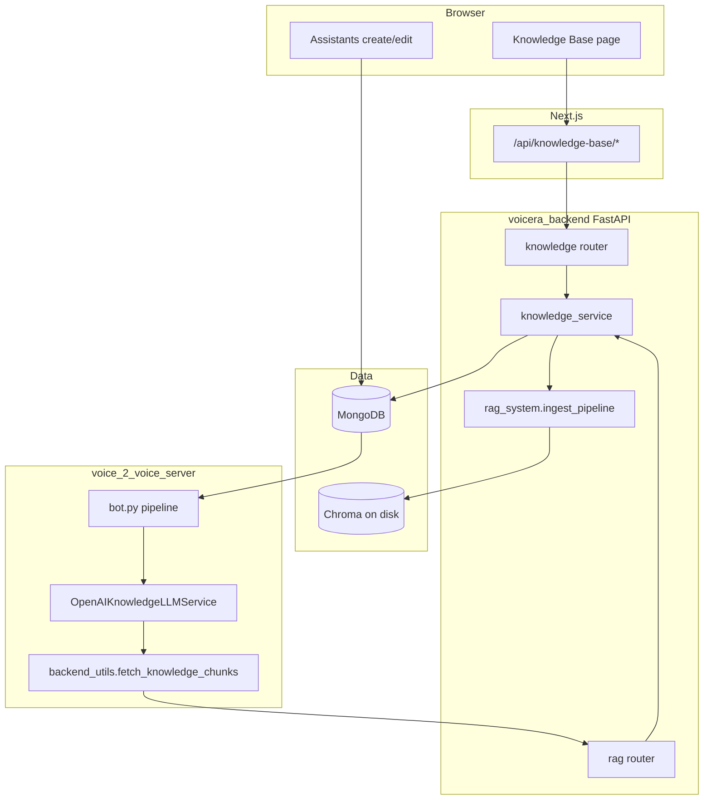

# How RAG connects to the whole Voicera platform

This guide is for you if you **wrote and understood `rag_system/`** (PDF → chunks → embeddings → Chroma) but feel lost about **everything that was added** to hook it into the **frontend, backend, agents, voice server, and Docker**.

It explains **what each layer does** and **how data moves**—not line-by-line code.

**Companion (tables, troubleshooting, file inventory):** [everything_about_rag_integration.md](everything_about_rag_integration.md)

---

## 1. What you had before: `rag_system` only

In the folder `voicera_backend/rag_system/` you effectively had a **local pipeline**:

- PDF → text → chunks → call OpenAI to embed → store vectors in **Chroma on disk**
- Optional scripts: query Chroma, answer with chat, etc.

Everything ran **on your machine**, often from a terminal, with **you** choosing files and folders. There was **no** web UI, **no** multi-tenant orgs, **no** “this agent uses these documents,” and **no** automatic link to phone/voice calls.

---

## 2. What “integration” added: four big ideas

Integration means: **the same ideas** (chunks + embeddings + Chroma + OpenAI), but **driven by the product** instead of by hand.

| Idea | What it is |
|------|------------|
| **1. Identity & org** | Every user belongs to an **organization**. Knowledge documents and Chroma data are **scoped per org** (hashed folder under `CHROMA_BASE_DIR/orgs/...`). |
| **2. Metadata in MongoDB** | The UI does not read Chroma directly for “list my files.” A Mongo collection **`KnowledgeDocuments`** stores each upload: `document_id`, filename, `status` (`processing` / `ready` / `failed`), chunk counts, errors. |
| **3. HTTP API** | The **FastAPI backend** exposes routes so the **Next.js app** can upload PDFs, list docs, delete docs, and (for the voice stack) **retrieve chunks** at call time. |
| **4. Agent config** | When you build an assistant, you choose **OpenAI** + **Knowledge base** + **which document IDs**. That is saved inside the agent’s **`agent_config`** in Mongo. The **voice server** reads that when a call starts and calls the backend to fetch chunks for each user turn. |

So: **`rag_system`** is still the **engine** for ingest; the **platform** adds **auth, persistence, UI, and runtime wiring**.

---

## 3. Where things live (mental map)

---

## 4. Flow A — “I uploaded a PDF in the UI”: every step

1. **You** open **Knowledge Base** in the dashboard (`voicera_frontend`).

2. The page calls the **Next.js API route** (server-side), not the Python API directly from the browser in a special way—it uses your **JWT**:
   - File: `voicera_frontend/app/api/knowledge-base/route.ts`
   - **POST**: forwards **multipart form** (PDF + `org_id`) to  
     `POST {BACKEND}/api/v1/knowledge/upload`  
     with `Authorization: Bearer <token>`.

3. **FastAPI** handles upload:
   - File: `voicera_backend/app/routers/knowledge.py`
   - Checks you are allowed to use that `org_id`.
   - Inserts a row in Mongo **`KnowledgeDocuments`** with `status: processing` and a new **`document_id`** (UUID).
   - Schedules **`knowledge_service.run_ingest_job`** as a **background task** (same process as uvicorn—so the HTTP response can return quickly with “processing”).

4. **`run_ingest_job`** (file: `voicera_backend/app/services/knowledge_service.py`):
   - Loads the OpenAI key from **Integrations** for that org (**not** from a loose `.env` key for KB).
   - Imports **`ingest_pdf_bytes`** from **`rag_system.ingest_pipeline`**.
   - That runs your pipeline: temp PDF → `pdf_to_text` → `chunk_text` → `embed_openai` → **Chroma upsert** under that org’s directory, collection **`rag_docs`**, metadata includes **`document_id`** so retrieval can filter.

5. When done, **`update_document`** sets Mongo to **`ready`** (or **`failed`** with a message).

**What you no longer do manually:** pick chroma path per hand for each upload—the backend derives the org path and passes the integration key into the pipeline.

---

## 5. Flow B — “I enabled Knowledge base on an assistant”

1. In **Assistants** UI (`voicera_frontend/app/(dashboard)/assistants/...`), when LLM is **OpenAI**, the form can set:
   - `knowledge_base_enabled`
   - `knowledge_document_ids` (subset of IDs from Mongo / list API)
   - `knowledge_top_k`

2. Saving the agent stores these inside **`agent_config`** on the agent document in **Mongo** (via the normal agents API—same as other LLM/STT/TTS settings).

Nothing is embedded again at save time; you are only **recording which document IDs** this agent may use **later at runtime**.

---

## 6. Flow C — “I’m on a call”: how retrieval hits your Chroma

The voice app is a **separate process** (`voice_2_voice_server`). It does **not** open Chroma files on its own for KB. It asks the **backend** to search Chroma.

1. **Call starts** — `voice_2_voice_server/api/bot.py` loads **`agent_config`** (fetched from backend earlier / passed in depending on entrypoint). For OpenAI, it copies the three KB fields into **`llm_config`**.

2. **`create_llm_service`** (`voice_2_voice_server/api/services.py`) builds **`OpenAIKnowledgeLLMService`** instead of plain OpenAI when provider is OpenAI—passing `org_id`, enabled flag, document IDs, top-k.

3. **Each time the user speaks** and text is sent to the LLM, **`OpenAIKnowledgeLLMService._process_context`** (`voice_2_voice_server/services/openai_kb_llm.py`):
   - If KB is off or no docs selected → **no** retrieve call.
   - Else it calls **`fetch_knowledge_chunks`** in `voice_2_voice_server/api/backend_utils.py`.

4. **`fetch_knowledge_chunks`** is an HTTP **POST** to:  
   `{VOICERA_BACKEND_URL}/api/v1/rag/retrieve`  
   with JSON: `org_id`, `question` (user text), `top_k`, `document_ids`.  
   It sends header **`X-API-Key: INTERNAL_API_KEY`** so only your services can call it.

5. **Backend** `voicera_backend/app/routers/rag.py` verifies the key, then **`knowledge_service.retrieve_chunks_for_query`**:
   - Again uses **Integrations** OpenAI key to **embed the question** (same embedding model family as ingest).
   - Opens **the same Chroma directory** for that org.
   - Queries **`rag_docs`**, filtered to the selected **`document_ids`**.
   - Returns chunk texts + metadata as JSON.

6. The voice server **temporarily rewrites** the latest user message to include “here are excerpts…” then calls OpenAI, then **restores** the original message so context does not grow forever.

**Critical:** Ingest and retrieve must see the **same** `CHROMA_BASE_DIR` and org layout—normally true if the **same backend container** does both.

---

## 7. Docker: how it fits together

You do **not** run a separate “RAG server” container anymore. RAG ingest runs **inside** the **backend** container.

- **Image:** `voicera_backend/Dockerfile` — installs Python deps from `requirements.txt` (**includes `chromadb`**). **Slim** images needed extra OS packages (`gcc`, `g++`, `libgomp1`) so `chromadb`’s native stack can load.
- **Compose:** `docker-compose.yml` mounts `./voicera_backend:/app` for dev so code edits apply; Chroma data usually ends up under `voicera_backend/rag_system/chroma_data/...` on the **host** unless you set **`CHROMA_BASE_DIR`** elsewhere.
- **Voice server** container (if you run full stack) has **`VOICERA_BACKEND_URL`** pointing at the backend service (e.g. `http://backend:8000`) and **`INTERNAL_API_KEY`** matching the backend.

If the backend runs in Docker but Chroma paths or keys differ from what you expect, uploads can “succeed” in UI terms but calls might get no chunks—same doc’s troubleshooting section in [everything_about_rag_integration.md](everything_about_rag_integration.md).

---

## 8. Authentication & secrets (who trusts whom)

| Mechanism | Used for |
|-----------|----------|
| **JWT (Bearer)** | Browser → Next → Backend for `/api/v1/knowledge/*` (user identity, org). |
| **`INTERNAL_API_KEY`** | Voice server → Backend for `/api/v1/rag/retrieve` and other bot endpoints. |
| **Integrations (OpenAI)** | Backend embeds for ingest and for query embedding in `retrieve_chunks_for_query`. |

---

## 9. How this maps back to “your” files

| Your original world | Platform role |
|---------------------|---------------|
| `ingest_pipeline.py` | Still the core; invoked by **`knowledge_service.run_ingest_job`**, not by you from CLI. |
| `chunk_text` / `pdf_to_text` / `embed_openai` | Unchanged roles; called **inside** `ingest_pipeline`. |
| Chroma on disk | Still Chroma; path is **org-scoped** and managed by **`CHROMA_BASE_DIR`**. |
| CLI scripts (`query_chroma`, etc.) | **Optional**; the product path does not use them. |

---

## 10. What to read next

- **Deeper reference (Dockerfile lines, env table, optional files list):** [everything_about_rag_integration.md](everything_about_rag_integration.md)
- **`agent_config` field names and gating:** [KB_Voicera_Runtime_Integration.md](KB_Voicera_Runtime_Integration.md)
- **Offline CLI pipeline cheat sheet:** [README.md](README.md)

---

## 11. One-sentence summary

**You built the RAG engine in `rag_system/`; the platform wraps it with Mongo for document status, FastAPI for uploads and retrieval, Next.js as a secure proxy to the API, Integrations for OpenAI keys, and the voice server as a client that calls the backend’s `/rag/retrieve` on every relevant user turn.**
